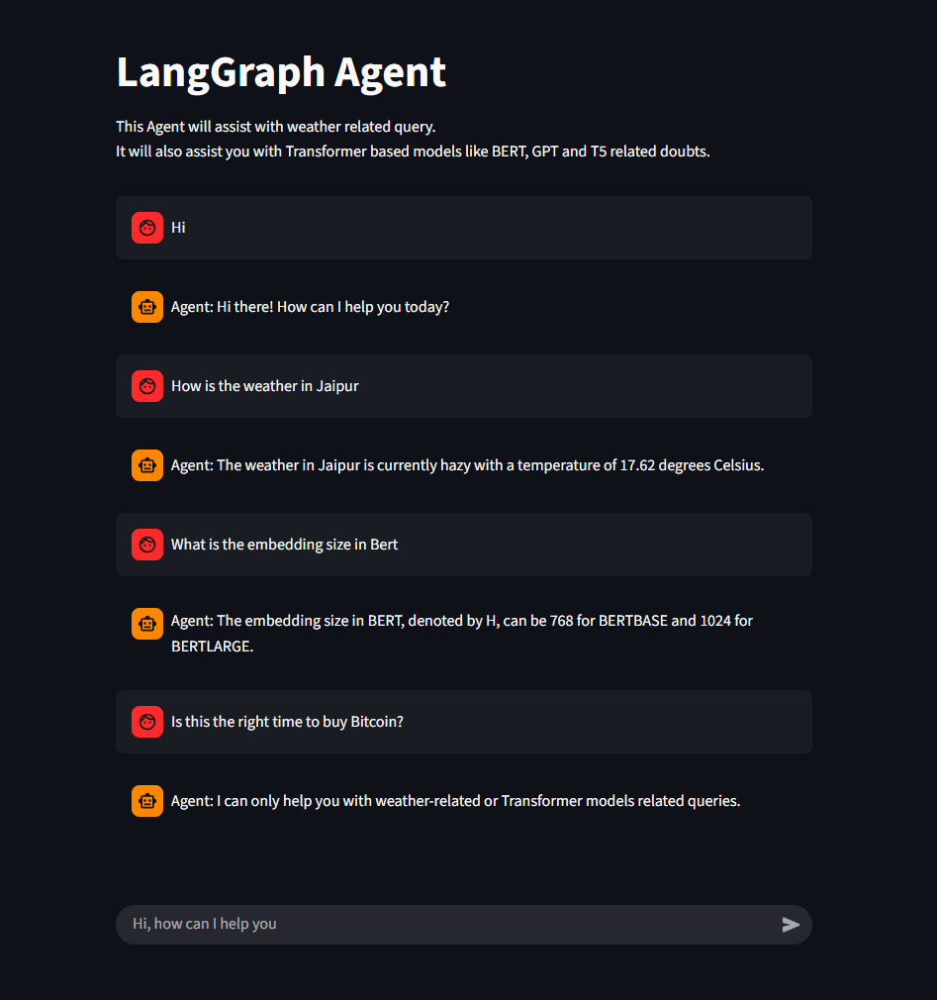
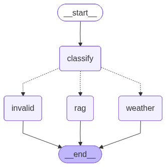
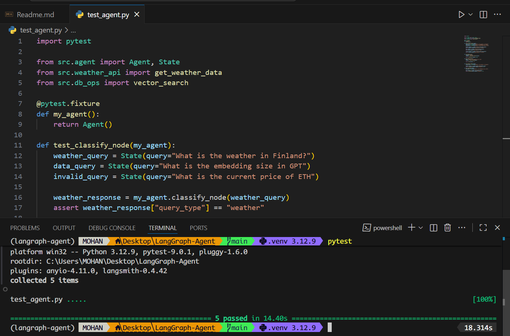

# LangGraph Agent

This agent, helps you with weather related queries, and it also helps you with queries related to technical topics like Transformers, BERT, GPT and T5 models.<br><br>

<br>

This agent is desigend using ```LangGraph```, ```Qdrant``` and ```Google Gemini models```.<br>

To run this agent in your local machine, follow these steps:
1. <b>Set-up the .env file</b>
   ```bash
    GOOGLE_API_KEY=<your google gemini api key>

    WEATHER_API_KEY=<your open weather map api key>

    QDRANT_API_KEY=<qdrant api key>
    QDRANT_CLUSTER_URL=<qdrant cluster url>
   ```
2. <b>Set-up the environment,</b> for environment setup I have used [uv](https://docs.astral.sh/uv/guides/install-python/)
   ```bash
    # langgraph supports python>=3.11
    uv venv --python 3.12

    # for windows:
    .venv\Scripts\activate

    # for mac:
    source .venv/bin/activate

    # install dependencies
    uv pip install -r requirements.txt
   ```
3. <b>```src/cfg.py```:</b>load the environment variables.

4. <b>```src/llm_stack.py```:</b> Instantiate the llm and embedding model.

5. <b>```src/weather_api.py```:</b> Script to fetch the weather data using the open weather map API.

6. <b>set-up the VectorDB:</b>
   - In the documents folder, add the pdf files on which you want to perform RAG.
   - I have added Transformers, BERT, GPT, and T5 paper pdfs.
   - I have used RecursiveCharacterTextSplitter for creating document chunks.
   - and "models/gemini-embedding-001" model for creating the embeddings.
  
    ```bash
    # First run db_ops.py file to set up the VectorDB
    db_ops.py

    #Then, run the pdf_pipeline.py file to create chunks, chunk embeddings,
    and this file will upload the embeddings to our vectordb.
    pdf_pipeline.py
    ```
7. <b>```src/agent.py```</b>: This file contains the LangGraph Agent<br><br>
   <br><br>
   - First the user query goes through ```classify node```, this node will send the query into any one of the next 3 nodes based on the query classification.
   - for e.g., a query like: "What is the weather in Finland?", will go through the ```weather node```.
   - and a query like: "What is the embedding size of BERT model?", will go through the ```rag node```.

8. <b>```app.py```</b>: This file containse the Streamlit app

After you have followed the above steps, run the below command to start the application.
```bash
streamlit run app.py

# or try this command:
python -m streamlit run app.py
```

## Pytest
```tests/test_agent.py```: contains simple tests for the agent nodes, weather api and vector search.<br>
for running the test just run the following command.
```bash
pytest
```
if all the tests are successfull, you will get the following response:<br>


## Evaluation using Langsmith

1. Uncomment ```@traceable``` decorator in ```agent.py``` file
2. Add these environment variables:
   ```bash
   LANGSMITH_API_KEY=<langsmith api key>
   LANGSMITH_PROJECT=<langsmith project id>
   LANGSMITH_ENDPOINT=<langsmith endpoint>
   LANGSMITH_TRACING=true
   ```
3. Create a dataset on langsmith platform or use langsmith sdk (I have used ```eval_dataset.json```).<br>
   Run the ```create_dataset()``` in ```langsmith_eval.py```.
   
4. Finally, run the ```langsmith_eval.py```.

### Langsmith logs

<br><br>
<br><br>
<br><br>
<br><br>